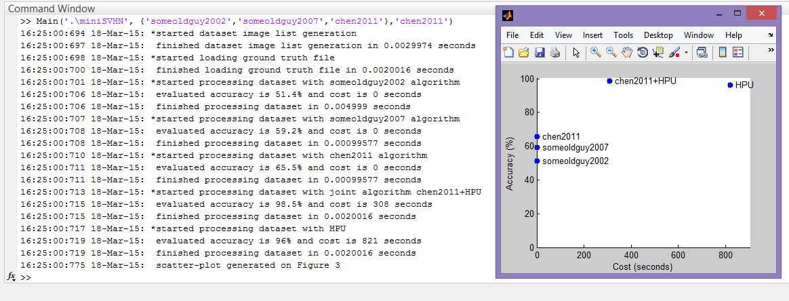
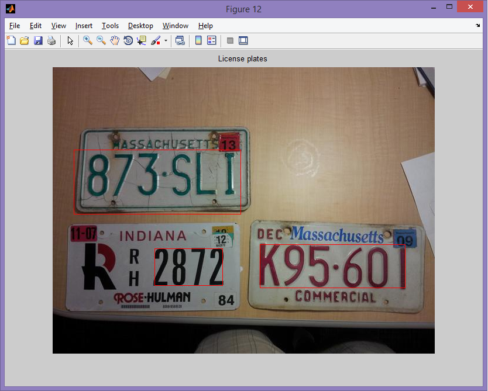

#CrowdCV

CrowdCV is an experiment to plot accuracy and cost of computer vision tasks as human inputs are combined. The human input is termed Human Processing Unit (HPU) and models the collective human input.

This folder contains scripts to run given segmentation algorithms on the [Street View House Numbers](http://ufldl.stanford.edu/housenumbers/) dataset under the following protocols:

* CPU only - runs given algorithms on the dataset, and evaluates for accuracy (assuming cost = 0)

* CPU+HPU - runs a state-of-the art algorithm on the dataset and takes human input to improve performance further and cost is the time spent by human(s).

* HPU only - runs the algorithm on the dataset completely by human input. According to hypothesis, this should give an accuracy comparable to CPU+HPU but cost (time spent) will be significantly higher.

##Usage:  
The main script can be invoked through Matlab console or another script in the following format:

	Main(DataSetPath, AlgoList, JointAlgo)
Arguments:  

* DataSetPath is the path the SVHN dataset.  
* AlgoList is a cell array containing algorithm file names as strings. File names exclude path and extension.  
* JointAlgo is the file name of algorithm to be used with HPU in CPU+HPU mode.

Example:

	Main('.\miniSVHN', {'someoldguy2002','someoldguy2007','chen2011'},'chen2011')

Gives an output like this:  
  
	
This is tested on Matlab 2014a with Computer Vision Toolbox included.

Note: For convenience a small dataset miniSVHN is included for testing convenience. It contains 20 items only.

##Progress

* Currently the accuracy and cost points on the plot are generated by stub functions in ProcessDataset script and are being implemented. The Process Dataset script has the main logic to run and evaluate each algorithm.

* Algorithms need to be implemented. An algorithm is a script such that it takes an RGB image matrix and returns a nx4 matrix where each row n represents a bounding box. chen2011 is the only Algorithm implemented as of now and does not have good accuracy.

chen2011 is based on a Matlab example, it suffers from few drawback that renders it unusable for the given dataset:  

* Is sensitive to low resolution and blur
* Requires careful tuning of many parameters

Below is an example to use chen2011 on a sample image

	plateImage = imread('.\licensePlates.jpg');
	eccentricityThreshold = 0.995;
	boxes = chen2011(plateImage,'TextPolarity','DarkTextOnLight',...
	    'MaxEccentricity', eccentricityThreshold);

Draw red bounding boxes to check

	figure; imshow(plateImage); title('License plates'); hold on
	for i=1:size(boxes,1)
	    rectangle('Position', boxes(i,:),'EdgeColor','r')
	end

Output:

Works well on tuning parameters such as text polarity and size range. However an ideal algorithm should just take an image and return an array of bounding boxes.

* More documentation will be added!